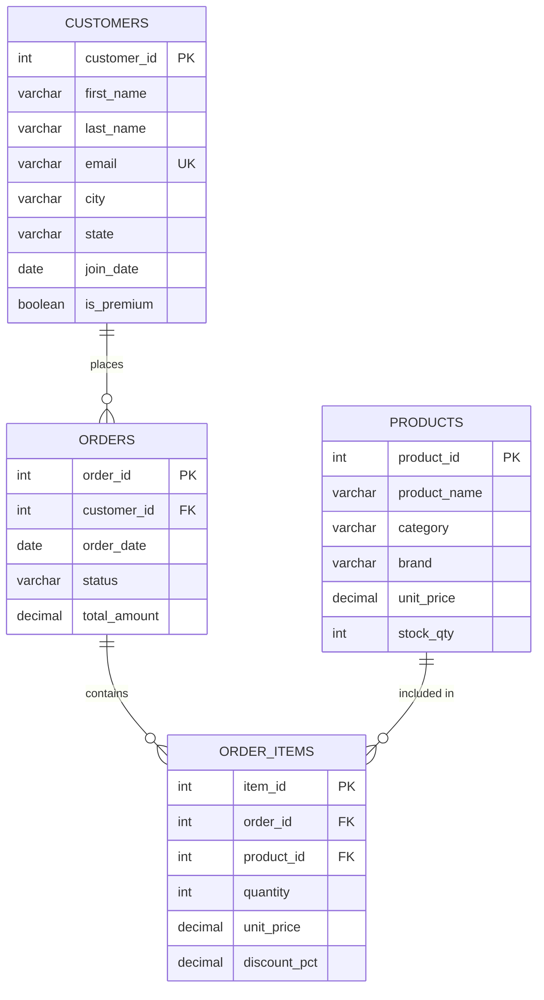

# 🛒 ShopEase — E-Commerce Sales Database Analysis

> **Celebal Summer Internship 2026 — Week 2 Task**

SQL-based analysis of an e-commerce company's relational database covering customers, products, orders, and order items. The project demonstrates SQL fundamentals through advanced concepts, producing actionable business insights.

---

## 📋 Table of Contents

- [Business Context](#-business-context)
- [Database Schema](#-database-schema)
- [Tech Stack](#-tech-stack)
- [Project Structure](#-project-structure)
- [Setup & Run](#-setup--run)
- [Query Sections](#-query-sections)
- [Key Business Insights](#-key-business-insights)
- [Sample Output](#-sample-output)
- [Author](#-author)

---

## 🏢 Business Context

**ShopEase** is a mid-sized e-commerce company selling electronics, clothing, and home products across India. As a Junior Data Analyst, the objective is to extract meaningful insights from their relational database to help management understand:

- Sales patterns and revenue trends
- Customer behavior and top spenders
- Product performance across categories
- Order fulfilment rates

---

## 🗄️ Database Schema

The database consists of **4 tables** with the following relationships:

```
customers ──(1:N)──▶ orders ──(1:N)──▶ order_items ◀──(N:1)── products
```

### Entity-Relationship Diagram



### Sample Data

| Table | Rows | Description |
|-------|------|-------------|
| `customers` | 8 | Customers across 8 Indian cities |
| `products` | 8 | Items in Electronics, Clothing, Home |
| `orders` | 10 | August 2024 orders |
| `order_items` | 15 | Line items with discounts |

---

## 🛠️ Tech Stack

| Tool | Purpose |
|------|---------|
| **SQL (SQLite)** | Database engine — standard SQL syntax, compatible with MySQL/PostgreSQL |
| **Python 3** | Query runner script with formatted output |
| **Git** | Version control |

> No external dependencies required — uses only Python's built-in `sqlite3` module.

---

## 📁 Project Structure

```
📦 shopease-sql-analysis/
├── 📄 README.md                 # This file
├── 📄 shopease_setup.sql        # Schema DDL + INSERT statements
├── 📄 shopease_queries.py       # Python script — runs all 27 queries
├── 📄 shopease_output.txt       # Complete query results (780 lines)
└── 📄 shopease.db               # SQLite database (auto-generated)
```

---

## 🚀 Setup & Run

### Prerequisites

- Python 3.6+ (no pip packages needed)

### Steps

```bash
# 1. Clone the repository
git clone https://github.com/<your-username>/shopease-sql-analysis.git
cd shopease-sql-analysis

# 2. Run all queries
python shopease_queries.py

# Output is printed to the console and also saved to shopease_output.txt
```

The script will:
1. Create a fresh `shopease.db` SQLite database
2. Load the schema and sample data from `shopease_setup.sql`
3. Execute all 27 queries (Sections A–E) + bonus validation queries
4. Print formatted results with business insights

> **Note:** The database is recreated on every run for reproducibility.

---

## 📝 Query Sections

### Section A — SQL Basics (Q1–Q6)

| # | Topic | Key Concept |
|---|-------|-------------|
| Q1 | Select all from customers | `SELECT *` |
| Q2 | Column projection | `SELECT col1, col2` |
| Q3 | Unique categories | `DISTINCT` |
| Q4 | Primary Key identification | PK = UNIQUE + NOT NULL |
| Q5 | Email constraints | `UNIQUE`, `NOT NULL` |
| Q6 | CHECK constraint demo | `CHECK (unit_price > 0)` |

### Section B — Filtering & Optimization (Q7–Q12)

| # | Topic | Key Concept |
|---|-------|-------------|
| Q7 | Filter by status | `WHERE` clause |
| Q8 | Multi-condition filter | `AND` operator |
| Q9 | Date range + state filter | `BETWEEN`, `AND` |
| Q10 | Exclude cancelled orders | `!=` operator |
| Q11 | Index explanation | B-tree index on `order_date` |
| Q12 | SARGability | Avoid functions on indexed columns |

### Section C — Aggregation (Q13–Q18)

| # | Topic | Key Concept |
|---|-------|-------------|
| Q13 | Order count | `COUNT(*)` |
| Q14 | Delivered revenue | `SUM()` with `WHERE` |
| Q15 | Avg price by category | `AVG()`, `GROUP BY` |
| Q16 | Revenue by status | `GROUP BY`, `ORDER BY` |
| Q17 | Price range per category | `MAX()`, `MIN()` |
| Q18 | High-value categories | `HAVING` clause |

### Section D — Joins & Relationships (Q19–Q23)

| # | Topic | Key Concept |
|---|-------|-------------|
| Q19 | Orders + customer names | `INNER JOIN` |
| Q20 | All customers + orders | `LEFT JOIN` |
| Q21 | 3-table join | Multi-table `JOIN` |
| Q22 | JOIN types comparison | LEFT vs RIGHT vs FULL OUTER |
| Q23 | FK constraints | Referential integrity demo |

### Section E — Advanced Concepts (Q24–Q27)

| # | Topic | Key Concept |
|---|-------|-------------|
| Q24 | Price tier classification | `CASE` expression |
| Q25 | Conditional aggregation | `CASE` inside `SUM()` |
| Q26 | ACID properties | Atomicity, Consistency, Isolation, Durability |
| Q27 | Atomic transaction | `BEGIN`, `COMMIT`, `ROLLBACK` |

### Bonus — Data Validation

- Row counts per table
- Monthly revenue trend
- Top 3 customers by spend
- Top 3 products by quantity sold
- Duplicate email check

---

## 📊 Key Business Insights

| Metric | Value |
|--------|-------|
| Total orders | 10 |
| Delivered orders | 6 (60% fulfilment rate) |
| Realized revenue | ₹17,191 |
| Shipped (pipeline) revenue | ₹13,596 |
| Top customer | Rohan Gupta — ₹8,397 (2 orders) |
| Top product (by volume) | Cushion Covers (Set) — 4 units |
| Highest avg category price | Clothing — ₹2,699 |
| Product categories | 3 (Electronics, Clothing, Home) |

### Highlights

- **Repeat buyers**: Aarav Sharma & Rohan Gupta — both premium members with 2 orders each
- **Electronics** has the widest price spread (₹899–₹3,499), indicating a diverse product portfolio
- **Home products** are volume leaders despite being the cheapest category
- **Discounts** range from 0% to 15%, with Cushion Covers receiving the steepest discount

---

## 📸 Sample Output

```
══════════════════════════════════════════════════════════════════════
  Section C — Aggregation (GROUP BY, SUM, COUNT, AVG, MIN, MAX)
══════════════════════════════════════════════════════════════════════

────────────────────────────────────────────────────────────
  Q16. Order count & revenue by status (sorted by revenue DESC)
────────────────────────────────────────────────────────────
SQL:
SELECT status,
       COUNT(*)            AS order_count,
       SUM(total_amount)   AS total_revenue
FROM orders
GROUP BY status
ORDER BY total_revenue DESC;

status    | order_count | total_revenue
----------+-------------+--------------
Delivered | 6           | 17191
Shipped   | 2           | 13596
Cancelled | 1           | 2999
Pending   | 1           | 1299

(4 row(s) returned)

💡 Insight: Delivered dominates with 6 orders / ₹17,191.
   Shipped orders (₹13,596) represent pipeline revenue.
```

---

## 👤 Author

**Ashmit** — Celebal Summer Internship 2026

---

## 📄 License

This project is for educational purposes as part of the Celebal Technologies Summer Internship program.
